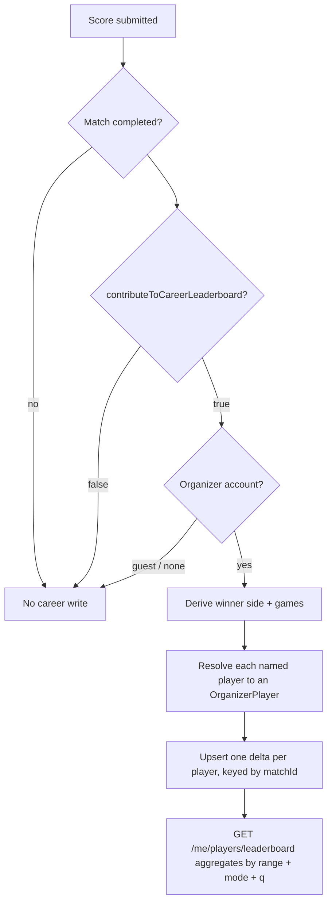

# Career leaderboard

How an organizer's cross-event player board is credited, ranked, filtered and searched.
Engineer-facing: read this before adding a new tournament mode, or the new mode will invent
credit rules the board cannot compare.

Surface: `GET /me/players/leaderboard`, `GET /me/players/:id`
(`apps/api/src/modules/organizerPlayers/`).

## The one rule

**Rank is match wins.** Every mode's scoreline is normalised to a single question — did this
player's side win the match? An Americano `14–10` win and a King of the Court `6–4` win are worth
exactly the same one match win. Games and points are stored and shown, but they never move a
player up the board.

## Opt-in

`Tournament.contributeToCareerLeaderboard` is a boolean, **default `true`**, accepted on create by
both `createTournamentSchema` (Americano / Mexicano) and `createKohTournamentSchema`. When it is
`false` the tournament plays and scores normally but writes **zero** career rows.

Credit is **ship-forward only**: turning the flag on does not backfill matches that were already
completed, and there is no historical backfill of events that finished before this feature
shipped. The only exception is the migration that labels pre-existing delta rows as
King of the Court, which is where they all came from.

## What creates a delta

One completed match creates one `OrganizerPlayerStatDelta` row **per named player** — four rows
for a doubles match, on both winning and losing sides.

| Mode | Credited when | `matchesWon` | `gamesWon` / `gamesLost` |
|------|---------------|--------------|--------------------------|
| Americano (points) | Points score submitted (`completed`) | Side with the higher score | `1` / `0` — rally points go to `americanoPointsWon` / `americanoPointsLost` |
| Mexicano (points) | Same as Americano | Side with the higher score | Same as Americano |
| Americano / Mexicano (Regular scoring) | Sets submitted with `status: COMPLETE` and a decided match | `evaluateMatch(...).winner` | Sum of set games |
| King of the Court (`KING_OF_THE_COURT`) | Court score submitted with `status: COMPLETE` | Winner-stays outcome | Sum of set games |

Each row also records `tournamentMode`, so the same ledger answers both the overall board and the
per-mode boards.

A drawn points match (`14–14`) records `matchesDrawn` and the rally points: nobody gets a match
win or a match loss, and no games. Draft scores, unfinished Regular scorelines and matches on
opted-out tournaments produce nothing.

**Americano has no games.** The credit path still writes a `1` / `0` into `gamesWon` / `gamesLost`
for a decisive points match, so every reader must normalise that away — see `isAmericanoPointsRow`
in `careerStats.ts`, which the board and the exports both use. Rally detail lives in
`americanoPointsWon` / `americanoPointsLost`.

Write path: `modules/organizerPlayers/infrastructure/careerCredits.ts`
(`creditMatchToOrganizerPlayers`). Americano and Mexicano reach it through the tournament module's
`CareerCredits` port after the aggregate is saved; King of the Court calls it inside the scoring
transaction.

## Identity

A career belongs to an `OrganizerPlayer`: **`organizerId` + normalized display name** (trimmed,
lowercased, whitespace collapsed). Two organizers who both run a "Sam" keep separate careers, and
one organizer's "sam" and "Sam " are the same person. There is no cross-organizer global board.

`Player` rows (per tournament) point at the career identity once resolved, so renaming a player
inside an event merges into the same career rather than forking a new one.

## Sort keys

Applied in `domain/careerStats.ts`:

1. `matchesWon` descending
2. display name ascending (`localeCompare`) — a stable tiebreak, not a quality signal

Rows also carry `gamesWon`, `gamesLost`, `matchesLost` and `eventsPlayed` for display. Ranks are
numbered over the whole range + mode aggregate **before** a name search narrows the rows, so a
searched player shows the position they actually hold on the board.

## What is *not* counted

- Raw Americano/Mexicano points as a ranking key — a 24-point blowout ranks the same as a 13–11 win
- Games or sets as a ranking key, in any mode
- Win percentage, streaks, Elo or any rating — not modelled
- Matches from opted-out tournaments, draft scores, and incomplete Regular matches
- Anything that happened before the tournament opted in (no backfill)

## Filters

| Query param | Values | Default |
|-------------|--------|---------|
| `range` | `month` \| `year` \| `all` | `year` |
| `mode` | `overall` \| `AMERICANO` \| `MEXICANO` \| `KING_OF_THE_COURT` | `overall` |
| `q` | Any string up to 80 chars | absent |

`range` is a lower bound on `occurredAt` (calendar month / calendar year, UTC). `mode` filters
deltas in SQL by `tournamentMode`; `overall` sums every mode. `q` is a case-insensitive substring
match on the aggregated display name applied after aggregation — blank or absent means no name
filter. All three combine. The response echoes `range` and `mode`, plus `q` when the caller
searched.

`KING_OF_THE_COURT` is the canonical wire value and the product label. `KING_OF_THE_HILL` is
accepted on **create** only, as a legacy alias, and normalised to Court — see
`LEGACY_KING_OF_THE_HILL` in `@padel/shared`.

## Idempotency

Deltas are unique per `(matchId, organizerPlayerId)` and written with an upsert, so:

- Re-submitting the same score overwrites the row instead of doubling it
- Correcting a score to the opposite winner moves the match win, it does not add one
- A retried request after a partial failure converges on the same totals

A career credit failure never fails the score submit: the Americano/Mexicano hook logs and
swallows it, so the tournament stays playable.

## Guests

Guest organizers have no career board. `GET /me/players/leaderboard` answers `200` with empty rows
plus `guest: true` and an "attach an account" message; `GET /me/players/:id` answers `403`. Guest
tournaments never write deltas because a delta needs an owning organizer account.

## Worked examples

**1. Americano 14–10 vs a 6–4 Regular win.** Ana and Ben beat Cara and Dan `14–10` in an opted-in
Americano. Kim and Lee win a King of the Court game `6–4` under the same organizer. Four deltas
per match, eight in total. On the overall board Ana, Ben, Kim and Lee all sit on one match win and
are separated only by name; Ana carries `gamesWon: 14`, Kim carries `gamesWon: 6`, and that
difference changes nothing about their order.

**2. Points do not buy rank.** "Pointsy" loses an Americano match `40–44` across two events;
"Winner" wins one King of the Court game `6–4`. Winner ranks first on one match win. Pointsy ranks
second with more raw games and zero match wins.

**3. Opted-out event.** An organizer creates a private Americano with
`contributeToCareerLeaderboard: false`, plays it out and scores every match. The tournament
leaderboard inside the event works normally; the career board is untouched — zero deltas, no new
rows, and the players' existing careers keep whatever they had.

## Credit flow

## Adding a new mode

1. Give the mode a `TournamentMode` enum value and add it to
   `organizerPlayerLeaderboardModeSchema`.
2. Persist `contributeToCareerLeaderboard` on create and honour it when scoring.
3. Call `creditMatchToOrganizerPlayers` on completion with a real winner side, the mode, and
   whatever the mode's "games" unit is — never invent a second ranking key.
4. Add a case to the credit table above and a golden test alongside
   `apps/api/tests/modules/organizerPlayers/careerRanking.test.ts`.

## Related

- Module notes: [`apps/api/src/modules/organizerPlayers/README.md`](../apps/api/src/modules/organizerPlayers/README.md)
- Epic: [`plans/implementation/backend/epic-15-career-leaderboard-system/`](../plans/implementation/backend/epic-15-career-leaderboard-system/README.md)
